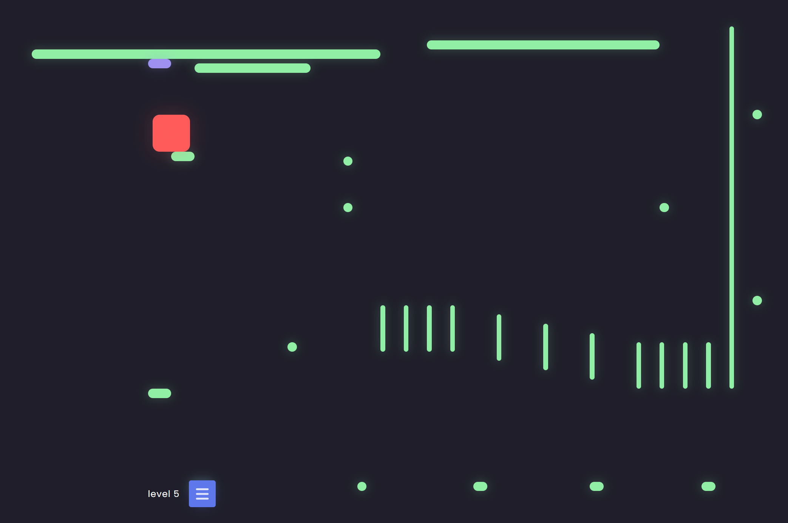

# My platformer 2D

Website URL : [Live site]()

## Intro

I created this platformer to have fun and practice. If you look at the code, don't be afraid, it's true that it's rather poorly organized with, as I imagine, lots of bad practices and bad code structures. So don't hesitate to review my code and send me feedback (my discord: miienzo). The list of improvements could be very long, I grant you that. But a few simple tips should help me, and I would be grateful.

## Let's move on to the interesting part:

### My difficulties in this project:

Surely the management of the character's collisions with the "parts". It was also the moment when I had the most fun.

### What I would like to improve:

I was a little bored in this project because sometimes, nothing was difficult, it was just very long. What seems very long to me is often linked to the fact that in all my web projects, I do the same thing, and I do not recover the components already created from my old projects, because adapting it would surely be very long, already that they must have a poorly structured code (as for this project finally). I do not really know how to do without repetitive moments, maybe I should not play the perfectionist too much?

### A project to continue ?

I wanted to make a level editor, but it would be quite long to do it. So I would like to have some motivation first, for example by having feedback. The choice of colors must surely be reviewed, and I will review this part later.

## Outro

I did my best in this project, investing 3 full days in a row. I am still proud of myself, to have made a functional and rather qualitative game for 3 days. I helped myself with a little ChatGPT for just a few aspects that I did not know or that I had forgotten about JavaScript. Otherwise, I didn't use any components from another user, this is really a home-made website, with pure HTML, CSS and JavaScript.

Dont forget to try the game ! : [Live site]()

Thanks for your attention, see you next time.
